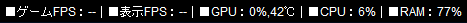
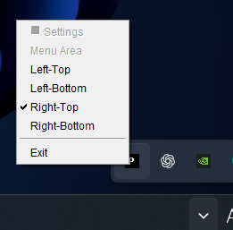

# PerfRibbon

[English](README.md) | [日本語](README.ja.md)

Windows向けのPC状態表示アプリです。ゲームFPS・表示FPS、GPU使用率・温度、CPU・RAM使用率を一行で表示し、約1秒ごとに更新します。リボンはクリックを背後のアプリへ通します。

## スクリーンショット

リボンの表示例（この画像ではFPSは未取得）：



表示位置の変更と終了を行う通知領域のメニュー：



## 動作環境

- 64ビットWindows
- 配布ZIPにはJavaを同梱しているため、Javaの追加インストールは不要です。
- GPU情報はNVIDIA（`nvidia-smi`）とAMD（ドライバー同梱のADLX）に対応します。取得できない項目は`--`になります。

## 起動・操作

1. 配布ZIPを展開します。
2. 展開したフォルダー内の`PerfRibbon.exe`を起動します。`app`・`runtime`フォルダーも必要なので、exeだけを移動しないでください。
3. **FPSを計測する場合は、exeを右クリックして「管理者として実行」を選びます。** 通常起動でFPSを取得できない場合も、CPU・RAM・GPUの表示は継続します。

通知領域の「P」アイコンを右クリックすると、表示位置の変更と終了ができます。

- `Left-Top`（初期位置）、`Left-Bottom`、`Right-Top`、`Right-Bottom`：メインモニターの4隅へ移動します。
- `Exit`：アプリを終了します。

表示位置は自動保存され、次回起動時に復元されます。

## 制限

- FPSは最前面のゲーム・アプリを計測します。別のアプリへ切り替えると計測対象も変わります。
- ゲームFPSはPresent呼び出し間隔、表示FPSは表示切り替え間隔から算出します。フレーム生成の識別可否はゲーム・ドライバーに依存します。
- 排他的フルスクリーンでのリボン表示は未検証です。下側に配置すると、タスクバーの背後に隠れる場合があります。
- NVIDIAとAMDの両方が取得可能な環境では、GPU選択機能が未実装のためGPU情報は`--`になります。

## 設定・アンインストール

設定は`%LOCALAPPDATA%\PerfRibbon\settings.json`に保存されます。

アンインストールするには、`Exit`で終了して展開したフォルダーを削除してください。設定も削除する場合は、`%LOCALAPPDATA%\PerfRibbon`フォルダーを削除します。

## 開発・配布用ビルド

Kotlin／JVM 21とGradleを使用しています。配布ZIPの作成には、64ビットWindowsとJDK 21の`jpackage`が必要です。

```powershell
# ソースから起動する（FPS計測には管理者PowerShellを使用）
.\gradlew.bat --no-daemon run

# 自動テストを実行する
.\gradlew.bat --no-daemon test

# exeとJavaを同梱したZIPをreleaseフォルダーへ出力する
.\package.ps1
```

初回ビルドにはインターネット接続が必要です。PresentMon 2.6.0を公式リリースから取得し、SHA-256を検証して同梱します。配布版の起動時にダウンロードは行いません。

## ライセンス

PerfRibbonの独自コードは[MITライセンス](LICENSE)で公開しています。外部ソフトウェア・ライブラリには、それぞれのライセンスが適用されます。

PresentMonのライセンスと第三者の通知は、ソースの`src/main/resources/presentmon/`、配布版の`licenses/PresentMon/`に収録しています。
